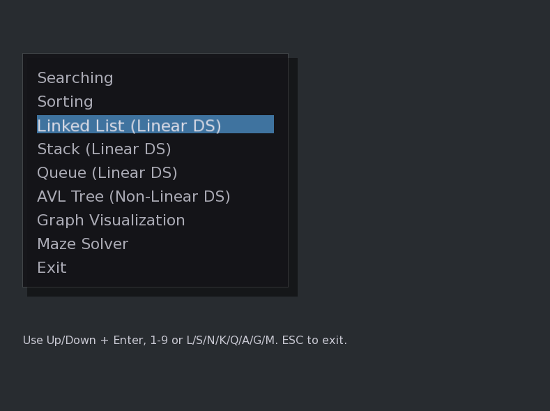

🧠 DSA Visualizer – Interactive Data Structures & Algorithms Playground

This repository contains a complete Data Structures & Algorithms (DSA) visualization project + exercises, developed as part of a university course. It includes both fundamental implementations and an interactive C++/SFML desktop application to visualize how these structures and algorithms work in real time.

The goal is to provide a hands-on, visual understanding of how data structures behave internally, how algorithms operate step by step, and how they can be applied to solve computational problems.

📊 Project Overview

This project combines classic DSA theory with practical C++ development and graphics programming.
It’s designed to help understand how data structures evolve, how algorithms execute, and how they can be applied to solve problems visually.

✅ Built with C++17
✅ Interactive UI built with SFML (Simple and Fast Multimedia Library)
✅ Modular design with separate implementations for each data structure and algorithm
✅ Includes educational demos and visualizations

🖥️ Features

The main menu of the program (shown below) lets you explore and interact with different components:

🔍 Searching Algorithms – Linear & Binary search visualized step-by-step

🔄 Sorting Algorithms – QuickSort, MergeSort, BubbleSort, etc., with animations

🔗 Linked List (Linear DS) – Node creation, traversal, insertion & deletion

📚 Stack (Linear DS) – Push/pop operations visualized dynamically

📬 Queue (Linear DS) – FIFO behavior and real-time updates

🌳 AVL Tree (Non-Linear DS) – Balanced BST insertion, rotations, and traversal

🧭 Graph Visualization – Nodes, edges, BFS/DFS traversal visualized

🧩 Maze Solver – Pathfinding demonstration using search algorithms

📸 Example main menu:

